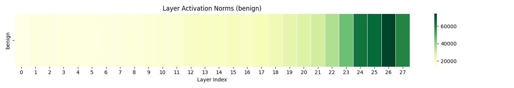
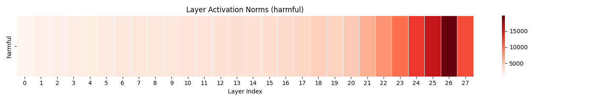

# SafeVision: Evaluating and Enhancing Jailbreak Robustness in Vision-Language Models

Vision-Language Models (VLMs) have quickly migrated from research demonstrations to high-stakes deployments, yet their vulnerability to multimodal jailbreaks remains under-explored. We benchmark several open-source VLMs on VLJailbreakBench to quantify attack success across modalities and evaluate lightweight defenses spanning  Direct Preference Optimization (DPO), Mixed Preference Optimization (MPO), and inference-time steering. Preliminary findings indicate that safety fine-tuning improves refusal rates but can induce noticeable utility regressions unless paired with steering-based guardrails. We aim to deliver an open framework for multimodal red-teaming, reveal key trade-offs between training-time and inference-time defenses, and highlight data requirements for scalable VLM safety alignment.


# Installation Guide

## 1. Clone the Repository
```bash
git clone https://github.com/JotatD/safe-vision
```

## 2. Create and Activate a Conda Environment
```bash
conda create -n internvl python=3.9
conda activate internvl
```

## 3. Install Dependencies
Install all default dependencies using the provided `requirements.txt`:

```bash
pip install -r requirements.txt
```

## 4. Download Testing Dataset (Attack Vectors)
- **VL Break Bench Data**: 
 [Download the dataset from Hugging Face](https://huggingface.co/datasets/wang021/VLBreakBench/tree/main) and keep it in the root directory.

 ```bash
git clone https://huggingface.co/datasets/wang021/VLBreakBench/tree/main
```


## 5. Download Training Dataset (Safety Alignment)

- **VL Break Bench Data**: 
 [Download the dataset from Hugging Face](https://huggingface.co/datasets/wang021/VLBreakBench/tree/main) and keep it in the root directory.

 ```bash
git clone https://huggingface.co/datasets/sqrti/SPA-VL
```


# Creating the finetuning dataset

Once VLBreakBench is downloaded, run the next command to create the dataset for finetuning InternVL models with RLHF-like methods. You will need to spcify the size of the dataset and the output folder. It will be a subset of the SPA-VL dataset with equal number of samples accross safety domains. 

 ```bash
python filtered.py
```

# Running Experiments (MPO-DPO)

For the 2 Billion Parameter InternVL3 finetuning with Mixed Preference Optimization
 ```bash
 sbatch finetune_job.sbatch
```

For the 2 Billion Parameter InternVL2 finetuning with Direct Preference Optimization
 ```bash
 sbatch finetune_job_weaker.sbatch
```

Upload the output to hugging-face with 
 ```bash
python upload.py
```
See https://huggingface.co/JotatD for the 3 MPO-DPO finetunes discussed in the project report.

## Results

| **Model**        | **Config**   | **Pre-MPO ASR** | **Post-MPO ASR** | **Δ Reduction** |
|------------------|--------------|------------------|-------------------|------------------|
| InternVL-2 1B    | Large Data   | 51.28%           | **7.98%**         | ↓ 43.30%         |
| InternVL-3 2B    | Small Data   | 56.14%           | 13.68%            | ↓ 42.46%         |
| InternVL-3 2B    | Large Data   | 56.14%           | **11.98%**        | ↓ 44.16%         |


# Benchmarking with Gemini

Run the safety benchmark by pointing to the desired Hugging Face repo or local path via `INTERNVL_PATH`. The file vlbreakbench_base_results.json comes from downloading 

```bash
export GEMINI_API_KEY=YOUR_KEY
export INTERNVL_PATH=models/InternVL3-2B   # or HF repo like JotatD/3-2b-large-dataset

python benchmarking/benchmark_safety.py
```

This will output the file vlbreakbench_base_results_<MODEL>.json, which contains the model's response to the attack. To evaluate these responses with Gemini, run:

```bash
python benchmarking/score_with_gemini.py \
  --input benchmark_results/vlbreakbench_base_results_<MODEL>.json \
  --output benchmark_results/vlbreakbench_base_results_<MODEL>_scored.jsonl
```

## Results

Check the output of the finetuned models and Gemini's judgement [here](https://mbzuaiac-my.sharepoint.com/personal/mashrafi_monon_mbzuai_ac_ae/_layouts/15/onedrive.aspx?id=%2Fpersonal%2Fmashrafi%5Fmonon%5Fmbzuai%5Fac%5Fae%2FDocuments%2FResults%5Fjson&ct=1764317544063&or=Teams%2DHL&ga=1&LOF=1)
# Steering

To create the steering vector:

```bash
python create_steering_vector.py
```
 
To run the steering benchmark:

```bash
python run_steering_benchmark.py
 ```

## Outputs





### 🏆 **InternVL Family**

- **InternVL 3.0**: 📖 [Intro](https://internvl.readthedocs.io/en/latest/internvl3.0/introduction.html) | ⚡ [Quick Start](https://internvl.readthedocs.io/en/latest/internvl3.0/quick_start.html) | ✨ [Finetune](https://internvl.readthedocs.io/en/latest/internvl3.0/finetune.html) | 📊 [Evaluate](https://internvl.readthedocs.io/en/latest/internvl3.0/evaluation.html) | 📦 [Deploy](https://internvl.readthedocs.io/en/latest/internvl3.0/deployment.html) | 🎯 [MPO](https://internvl.readthedocs.io/en/latest/internvl3.0/preference_optimization.html)
- **InternVL 2.0**: 📖 [Intro](https://internvl.readthedocs.io/en/latest/internvl2.0/introduction.html) | ⚡ [Quick Start](https://internvl.readthedocs.io/en/latest/internvl2.0/quick_start.html) | ✨ [Finetune](https://internvl.readthedocs.io/en/latest/internvl2.0/finetune.html) | 📊 [Evaluate](https://internvl.readthedocs.io/en/latest/internvl2.0/evaluation.html) | 📦 [Deploy](https://internvl.readthedocs.io/en/latest/internvl2.0/deployment.html) | 🎯 [MPO](https://internvl.readthedocs.io/en/latest/internvl2.0/preference_optimization.html)
